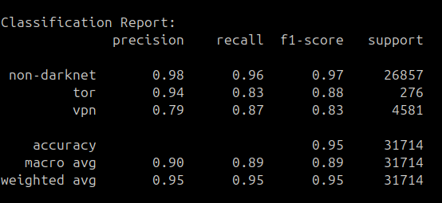
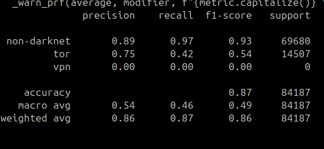
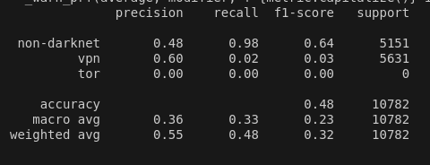

# Steps to test the model

## Download the datasets

- Install Darknet and Tor-NonTor (ISCX) dataset from here : https://www.unb.ca/cic/datasets/index.html

## Setting up the Environment

- run ```python3 -m venv venv``` to setup virtual python environment
- run ```source venv/bin/activate``` to start virtual environment

## Install Dependencies

- run ```pip install requirements.txt``` to install all the dependencies needed

## Create images

- run ```python3 data_to_img*.py``` to convert data into image (name of CSVs are hardcoded so don't forget to change them)
- code will ask you the name of directory to save the images
- Images will need at least 600-700 MB of space for Darknet dataset so choose path with sufficient space

## Testing the Model

- run ```python3 test.py``` to test model on generated images
- code will ask about csv for image info, put the filename ```image_info_*.csv``` according to the code executed in above step

## Training the Model

- Follow all steps above till 'create images'
- run ```python3 model.py``` after putting the filename ```image_info_*.csv``` accordingly.

# Classification Reports on different datasets

## CICDarknet2020 dataset




## ISCX Tor-NonTor dataset




## ISCX VPN-NonVPN dataset

