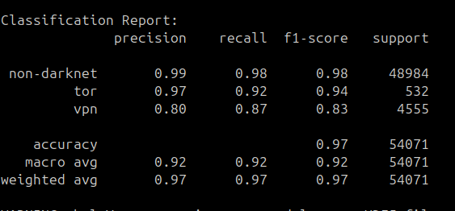

# Setting up the code

## Download the datasets

- Install Darknet ( Dark web - CICDarknet2020), Tor-NonTor (ISCX) and VPN-NonVPN (ISCX) dataset (PCAP files) from here : https://www.unb.ca/cic/datasets/index.html

## Setting up the Environment

- run the following command to setup virtual python environment
```
python3 -m venv venv
```
- run the following command to start virtual environment
```
source venv/bin/activate
```

## Install Dependencies

- run the following command to install all the dependencies needed
```
pip install requirements.txt
```
- install libpcap to use pcap to csv convertor
```
sudo apt-get install libpcap-dev
```

# PCAP to CSV with labels

- Convert PCAP files to CSV using the following commands :
```
chmod +x convert_pcap_with_label.sh
```
```
./convert_pcap_with_label.sh <path_to_directory_with_pcap_files> <label_for_data>
```
- label_for_data must be one of `tor`, `vpn` or `non-darknet`
- These commands will generate `output.csv`.

# Training the model

- Convert PCAP to CSV with labels before training the model
- Use the following command to train the model :
```
python3 train.py <csv_filename>
```
- The model will be trained and stored as `model.h5`

# Testing the model

- Convert PCAP to CSV with labels before testing the model
- Use the following command to test the model :
```
python3 test.py <csv_filename>
```
- The classification report will be displayed on terminal

# PCAP to CSV

- Convert PCAP files to CSV using the following commands :
```
chmod +x convert_pcap.sh
```
```
./convert_pcap.sh <path_to_directory_with_pcap_files>
```
- These commands will generate `output.csv`.

# Prediction with the model

## By PCAP files

- Use the following commands for prediction using PCAP:
```
chmod +x predict.sh
```
```
./predict.sh <path_to_directory_with_pcap_files>
```
- Alert will be generated according to predicted anomaly

## By CSV file

- Use the following command to test the model :
```
python3 predict.py <csv_filename>
```
- Alert will be generated according to predicted anomaly

# Classification Report

- CICDarknet2020 dataset combined with ISCX Tor-NonTor (PCAP) dataset


